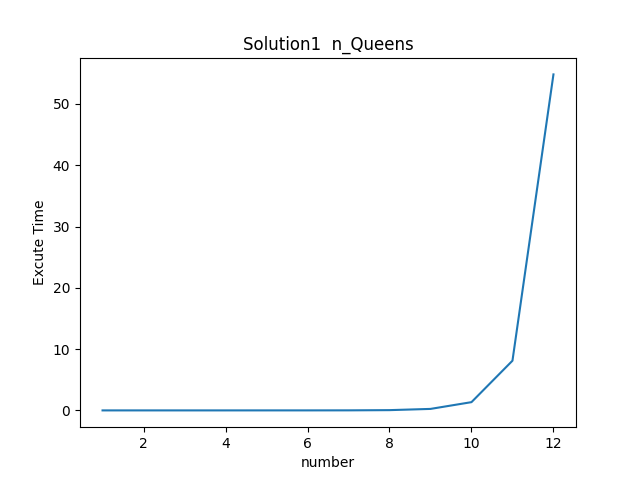

# 华南理工大学SCUT软件体系结构实验八皇后问题Python源码


<u>注意：该项目已停止维护!!!</u>


### 目录

[项目说明](#一、项目说明)

[文件结构](#二、文件结构)

[架构描述](#三、架构描述)

[模块描述](#四、模块描述)

[使用算法](#五、使用算法)

[设计模式](#六、设计模式)

[文件保存](#七、文件保存)


------

### 一、项目说明

本项目采用**python**语言编写八皇后的解法

在**Solution**文件夹下保存有Solution1~4四种解法

对于Solution2解法有采用三种设计模式进行修改，分别是**OOP Pattern，Pipe and Filter Pattern，Shared-Data Pattern**

项目中还包含可视化打印，运行时间保存和结果保存功能


### 二、文件结构

```bash
│  config.ini	//配置文件
│  Excute.py	//运行文件
│  getConfig.py	//获得相关配置参数
│  PrintBoard.py	//打印结果
│  readme.md
│  SaveExcuteTime.py	//保存程序运行时间
│  ViewExcuteTime.py	//可视化运行时间
│
│
├─ExcuteTime	//运行时间保存，包括.xlsx和.png
│      Solution1ExcuteTime.xlsx
│      Solution1TimeChart.png
│      Solution2ExcuteTime.xlsx
│      Solution2TimeChart.png
│      Solution2_GPUExcuteTime.xlsx
│      Solution2_GPUTimeChart.png
│      Solution2_OOPPatternExcuteTime.xlsx
│      Solution2_OOPPatternTimeChart.png
│      Solution2_PipeAndFilterExcuteTime.xlsx
│      Solution2_PipeAndFilterTimeChart.png
│      Solution2_SharedDataPatternExcuteTime.xlsx
│      Solution2_SharedDataPatternTimeChart.png
│      Solution3ExcuteTime.xlsx
│      Solution3TimeChart.png
│      Solution4ExcuteTime.xlsx
│      Solution4TimeChart.png
│
├─result	//运行结果文件保存
│      Solution1Result.txt
│      Solution2Result.txt
│      Solution2_GPUResult.txt
│      Solution2_OOPPatternResult.txt
│      Solution2_PipeAndFilterResult.txt
│      Solution2_SharedDataPatternResult.txt
│      Solution3Result.txt
│      Solution4Result.txt
│
├─Solution	//算法文件存储目录
      Solution1.py
      Solution2.py
      Solution2_GPU.py
      Solution2_OOPPattern.py
      Solution2_PipeAndFilter.py
      Solution2_SharedDataPattern.py
      Solution3.py
      Solution4.py
      test.py	//测试算法运行文件

```


### 三、架构描述

#### 1、参数配置

**config.ini**文件的参数配置如下

```ini
[DEFAULT]
#设置皇后数量
QueenNumber = 14
#存放解法的文件夹
Solutiondir = Solution
#解法的名称
Solutionname = Solution4
#棋盘结果位置
resultpath = result
#运行时间记录
ExcuteTimepath = ExcuteTime
```

QueenNumber :棋盘上存在的皇后数量，用于确定棋盘大小

Solutiondir :解法存放的文件夹

Solutionname :选择使用解法的名称

resultpath :存放结果的文件夹，用于保存当前棋盘大小的解法数量

ExcuteTimepath :运行所用时间的保存路径，可以得到.xlsx和.png两种运行时间保存的格式


#### 2、执行文件描述

**Execute.py** :总的程序执行文件(相当于main.py)，这个文件将会调用Solution下的各种算法，保存当前数量的运行结果于result文件中，并且将每个皇后数量的运行时间文件保存在ExcuteTime文件底下


**getConfig.py** :获得配置文件中的各类参数，默认从[DEFAULT]块下获得相关的Option


**Solution.py** :各类算法的调用，输入是当前皇后数量的参数，输出是解法总和与棋盘摆放的字符化结果


**test.py** :测试Solution.py是否能正常跑动用例


**PrintBoard.py** :将字符化的棋盘摆放结果存放到result文件底下


**SaveExcuteTime.py** :将每个数量的运行时间以excel表格格式保存在ExecuteTime文件目录下


**ViewExcuteTime.py** :将可视化的运行时间以图片格式保存在ExecuteTime文件目录下


### 四、模块描述


##### 1、Execute.py

**导入模块**，从Solution文件夹下导入对应的解法文件

```python
# 导入模块处理
def importmodule():
    # 将Solution文件夹添加到模块搜索路径
    solution_folder = os.path.join(os.path.dirname(__file__), getConfig("Solutiondir"))
    sys.path.append(solution_folder)

    # 获取Solution的值
    solution_name = getConfig("Solutionname")

    # 导入Solution模块
    solution_module = __import__(solution_name)
    return solution_module

# 导入相关算法模块
mymodule = importmodule()
```


**运行模块**，遍历皇后数量，从1执行到n，计算每个皇后的数量所运行的时间，并且最后获得数量n的结果

```python
for i in range(1, number + 1):
    starttime = time.time()
    # NOTE:此处选择相关算法进行计算
    # 返回的是一个三维的result
    # 一个维度是总的解法数
    # 另两个维度是棋盘摆放的方法
    result = mymodule.Run(i)
    endtime = time.time()
    # 记录运行时间
    runtime.append(endtime - starttime)
    counts.append(i)
```


##### 2、getConfig.py

设置使用块，并且通过调用函数来获得相应的option

```python
# 使用相关块
use = "DEFAULT"

def getConfig(option: str, section: str = use):
    config = configparser.ConfigParser()
    config.read('config.ini', encoding='utf-8')
    return config.get(section, option)
```


##### 3、Solution.py

一般解法都是通过调用Run接口来驱动整个文件跑动的，Run函数输入是皇后数量，输出是皇后字符化摆放结果，这是一个"间接性"规则的设计，方便内部代码修改而不影响外部调用

```python
# 跑动整个算法
def Run(i: int):
    return n_Queen(i)
```


### 五、使用算法

##### 1、Solution1.py

**Solution1:基于递归的n皇后摆布（暴力枚举法）**

1、逐行遍历棋盘，在每列格子都尝试摆放皇后

```python
    def put(row: int):
        ...
        for i in range(n):
            ...
            put(row + 1)
            ...
```

2、摆放之后遍历整个棋盘，判断是否有摆放冲突，如果没有则继续下一行的遍历，有则停止

```python
# 判断摆布的位置是否会与其他皇后发生冲突
def conflict(board: List[List[str]], row: int, column: int):
    # 发生冲突的条件:row+column相同位置摆放有皇后,fabs(row-column)相同位置摆放有皇后
    # 或者相同row的地方摆放有皇后，相同column的地方摆放有皇后
    n = len(board)
    # 整个棋盘遍历
    for i in range(n):
        for j in range(n):
            if i == row or j == column or i + j == row + column or i - j == row -column:
                # 真的摆放有皇后
                if board[i][j] == queen_config:
                    return True
    # 没有摆放皇后
    return False
```

```python
# 如果不发生冲突则摆放
if not conflict(board, row, i):
    board[row][i] = queen_config
    # 继续下一个摆放
    put(row + 1)
    board[row][i] = space_config
```


3、遍历该列的每一格，直到所有都遍历完才结束

```python
# 可以完成遍历棋盘摆放皇后
if row == n:
    result.append(copy.deepcopy(board))
    return
```

**时间复杂度O((n^2)*(n^n))**，及其大，不适合实际运用


##### 2、Solution2.py

**Solution2:基于回溯的n皇后解法---相较于Solution1的conflict改进**
conflict产生条件：
(1)处在同一列
(2)处在左上右下的斜对角线上:row-column为定值
(3)处在左下右上的斜对角线上:row+column为定值

```python
# 如果发生冲突则跳过
if i in column or row - i in diagonal_cut or row + i in diagonal_add:
    continue
```

所以可以考虑采用set来存放不可放置皇后位置

```python
# 均使用set记录
# 记录已经存放column的位置
column = set()
# 记录左上右下对角线已经存放皇后的位置
diagonal_cut = set()
# 记录左下右上对角线已经存放皇后的位置
diagonal_add = set()
```

**时间复杂度O(n^n)**，更快了


##### 3、Solution3.py

**Solution3:基于位运算的n皇后解法---相较于Solution1的conflict改进**
有三个二进制位column,diagonal_cut,diagonal_add，分别代表同一列，左上右下，左下右上的位置是否可放置八皇后

```python
column: int, diagonal_add: int, diagonal_cut: int
```

如果bit位为1，则无法放置
逐行遍历：
column保持不变
diagonal_add向左移动一位
diagonal_cut向右移动一位

```python
put(row + 1, column, diagonal_add << 1, diagonal_cut >> 1)
```

三者取或可以排除不可选的位置，直到找到合适的位置并且放置皇后

```python
# 这个是可以放置的位置
available = ((1 << n) - 1) & (~(column | diagonal_add | diagonal_cut))
while available:
    # 用x&(-x+1)取最低位
    currentput = available & (~available + 1)
    ...
    # 用x&(x-1)逐项遍历
    available &= (available - 1)
```


##### 4、Solution4.py

**Solution4:基于迭代的n皇后解法---相较于Solution2的递归改进**

使用递归的方法往往会使程序运行速度更慢

若改用迭代的方法运行程序，可能可以使程序运行更快些

idea:
通过一个数组position[]记录每次摆放时当前列的皇后的位置

position的下标表示所处行的位置

```python
# position记录每行皇后的列的摆放位置
# 其下标表示当前行所在列的位置
position = [0] * n
```

逐行逐列遍历即可

```python
# 当前行所在的位置
row = 0
while row >= 0:
    # 如果顺利到达第n行
    if row == n:
    	...
    	# 往回走一行
        row -= 1
    else:
    # 逐列遍历
    	if 0 <= position[row] < n:
    		...
        else:
        # 如果发生了列的越界
        # 重置当前行
        position[row] = 0
        # 向上移动一行
        row -= 1
   	# 最后如果没有发生行的越界
    if row >= 0:
        ...
        position[row] += 1
```


##### 5、Solution2_GPU.py

GPU版本运行八皇后，用二维张量来代表棋盘，在这个张量上进行相关操作(当然效果不太好)。

```python
torch.full((n, n), ord('#'), dtype=torch.long, device=device)
```


### 六、设计模式

##### 1、Solution2_OOPPattern.py

采用面向对象的设计模式，每个类的职能如下:
**Board 类**：创建一个 Board 类来表示国际象棋棋盘，该类包括方法来放置和移除皇后，以及检查皇后之间的冲突。

```python
# 在board class中存放棋盘以及摆放皇后之后的位置,并且可用判断是否存在conflict
class Board:
    def __init__(self, n: int):
        # 初始化棋盘大小
        self.board_size = n
        # 初始化棋盘，存放Queen
        self.board = []
        # 均使用set记录
        # 记录已经存放column的位置
        self.column = set()
        # 记录左上右下对角线已经存放皇后的位置
        self.diagonal_cut = set()
        # 记录左下右上对角线已经存放皇后的位置
        self.diagonal_add = set()

    # 检测是否发生冲突
    def conflict(self, currentqueen: Queen) -> bool:
		...
```

**Queen 类**：创建一个 Queen 类来表示皇后对象。这个类应该包括皇后的位置信息

```python
class Queen:
    def __init__(self, i: int, j: int):
        self.row = i
        self.column = j
```

**Solution 类**：创建一个 Solution 类来实现八皇后问题的解决算法。这个类应该包括递归函数或迭代函数，用于尝试放置皇后，并检查是否有冲突

```python
class Solution:
    def n_Queen(self, myboard: Board) -> List[Board]:
        ...
```

**FormatResult 脚本**:格式化棋盘输出


**Main 脚本**：创建一个 Main 脚本，用于初始化棋盘、调用求解器并展示解决方案。

```python
def Main(i: int):
    # 创建棋盘
    board = Board(i)
    # 解法调用
    mysolution = Solution()
    result = mysolution.n_Queen(board)
    # 返回格式化的结果
    return FormatResult(result, i)
```


##### 2、Solution2_PipeAndFilter.py

采用Pipe And Filter设计模式：

**Data_Source类**存放棋盘

```python
class Data_Source:
    def __init__(self, size: int):
        # 初始化创建棋盘
        self.board = [[space_config] * size for _ in range(size)]

    # 获得棋盘对象（封装性）
    def get_board(self):
        return self.board
```

**Filter类**用于摆放皇后以及判断皇后之间是否会发生冲突
process()函数用于处理皇后摆放位置,并且将得到的结果以编码形式返回
conflict()函数用于判断皇后之间是否发生冲突
putQueen()函数用于摆放皇后

```python
class Filter:
    def __init__(self):
        # 均使用set记录
        # 记录已经存放column的位置
        self.__column = set()
        # 记录左上右下对角线已经存放皇后的位置
        self.__diagonal_cut = set()
        # 记录左下右上对角线已经存放皇后的位置
        self.__diagonal_add = set()
        # 存放得到结果的编码
        self.process_result = []

    # 判断是否发生冲突
    def __conflict(self, currentRow: int, currentColumn: int) -> bool:
		...

    def __putQueen(self, currentRow: int, size: int, board: List[List[int]]):
        ...

    def process(self, data: Data_Source):
		...
        return self.process_result
```

**StoreResult类**用于保存成功摆放的编码结果为棋盘结果，并且最后读取结果
Store()函数将编码的结果转化为棋盘结果存储
getResult()返回棋盘结果

```python
class StoreResult:
    def __init__(self):
        self.result = []

    # 将编码的结果转化为字符化棋盘摆放
    def Store(self, data: List[List[int]]):
        ...

    # 返回整个棋盘的结果
    def getResult(self):
        return self.result
```


**Solve类**用于驱动管道数据流与过滤器运行，并且实现数据流之间的交互
数据源->数据过滤器->数据存储->读取结果

```python
class Solve:
    def Pipe_And_Filter_Driver(self, size: int):
        # 创建棋盘
        data = Data_Source(size)
        # 创建过滤器
        filter = Filter()
        # 创建存储器
        store = StoreResult()
        # 获取filter处理后的结果
        result = filter.process(data)
        # 将结果存储在store中
        store.Store(result)
        # 返回该结果
        return store.getResult()
```


##### 3、Solution2_SharedDataPattern.py

**Shared_Data_Pattern:**
**数据之间完全共享，没有隐私,非常危险，容易被误改**

```python
#global variable

# queen的表示图标
# 空格的表示图标
queen_config = "Q"
space_config = "#"
# 储存摆放的结果
result = []
# 棋盘
board = []

# 均使用set记录
# 记录已经存放column的位置
column = set()
# 记录左上右下对角线已经存放皇后的位置
diagonal_cut = set()
# 记录左下右上对角线已经存放皇后的位置
diagonal_add = set()

# 设定大小
size = 0
```


### 七、文件保存

##### 1、符号表示

通过定义全局变量queen_config与space_config来表示“皇后摆放"与"空余空间"

```python
queen_config = "Q"
space_config = "#"
```


##### 2、结果文件

result文件中保存每种解法的所有字符串结果，如Solution1Result.txt中：

```bash
皇后数量:12
解法总数:14200
运行用时:54.8133008480072秒
Q###########
##Q#########
####Q#######
#######Q####
#########Q##
###########Q
#####Q######
##########Q#
#Q##########
######Q#####
########Q###
###Q########

...
```


##### 3、执行时间

在ExecuteTime下有解法对应的执行时间

(1)在Excel文件中保存皇后数量与运行的时间，如Solution1ExcuteTime.xlsx中：

| 次数 | 运行时间    |
| ---- | ----------- |
| 1    | 0           |
| 2    | 0           |
| 3    | 0           |
| 4    | 0           |
| 5    | 0.00100112  |
| 6    | 0.002000093 |
| 7    | 0.008001566 |
| 8    | 0.04300952  |
| 9    | 0.243054628 |
| 10   | 1.345302105 |
| 11   | 8.106818914 |
| 12   | 54.81330085 |


(2)同时保存了对应的执行时间可视化结果，如Solution1TimeChart.png中：


